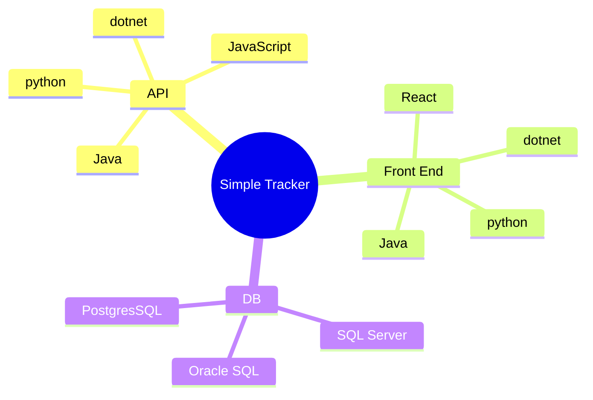

## simple-tracker-spec

An OpenAPI Spec and Postman Collection for APIs that are part of the "Simple Tracker" project. 

__Is there a language you just wanna tinker with? Give us an API or a Front End, just be sure to use the OpenAPI spec here to create your API.__ 

[Example API here](https://github.com/boxboat-github-practice/simple-tracker-express-api)

[Example Front End here](https://github.com/boxboat-github-practice/simple-tracker-express-web)

The idea here is that we need some sort of app that can be used in many contexts. Why one specific app? Because then we can easily recycle content. Why a bunch of languages? Because then we can tailor the demos, workshops, PoCs we do to match the audience's ecosystem.

__Every single API and Front End should have the following accompaniments__:
- Dockerfile
- devcontainer
- Actions workflow for building an image and storing it in GitHub Container Registry (ideally using a reusable workflow)

__The APIs should all additionally__:
- Include an Action workflow that can run a smoke test verifying the API conforms to the API Spec

Postman collections can be run in GitHub Actions using the `newman` collection runner. 

To Do:
- [ ] create reusable workflows for building containers
- [ ] write tests for the Postman Collection
- [ ] create reusable workflow for smoke tests
- [ ] creat reusable workflow for deploying to a long-living tools cluster 
- [ ] create helm chart for deploying a full microservice instance, allowing for hot swappabble units
- [ ] create the kube magic to make hot swapping possible, configmaps, secrets, etc
- [ ] architecture designs and IaC for AWS, Azure and others if you really want to

Let's start simple and keep that way as long as possible.
<!---

--->

