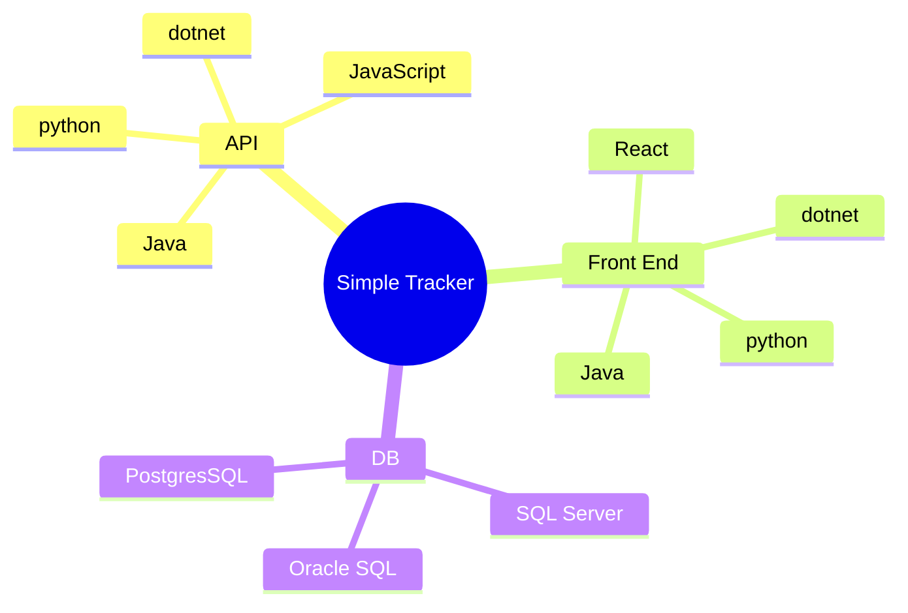

## simple-tracker-spec

An OpenAPI Spec and Postman Collection for APIs that are part of the "Simple Tracker" project. 

```mermaid
mindmap
  root((Simple Tracker))
    API
      Java
      ::icon(fa-brands fa-java)
      dotnet
      ::icon(fa-brands fa-microsoft)
      JavaScript
      ::icon(fa-brands fa-js)
      python
      ::icon(fa-brands fa-python)
    Front End
      React
      ::icon(fa-brands fa-react)
      dotnet
      ::icon(fa-brands fa-microsoft)
      python
      ::icon(fa-brands fa-python)
      Java
      ::icon(fa-brands fa-java)
    DB
      SQL Server
      ::icon(fa-brands fa-microsoft)
      Oracle SQL
      PostgresSQL
```